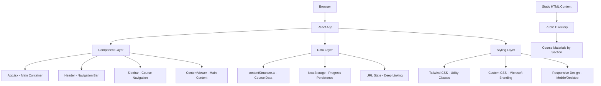
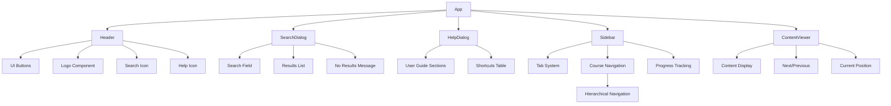
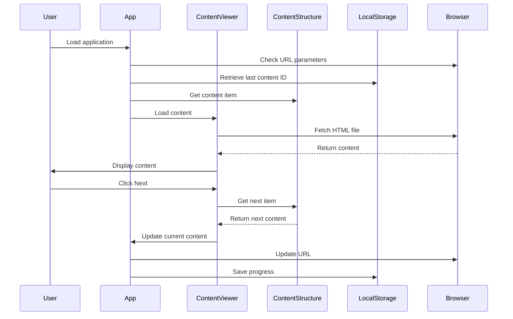

# Design Document

## Overview

The Microsoft 365 Copilot Learning Platform is a React-based single-page application that provides an immersive learning experience for Microsoft 365 Copilot features. The platform follows a component-based architecture with TypeScript for type safety, Tailwind CSS for styling, and modern React patterns for state management and user interaction.

The application serves as a comprehensive training portal that guides users through structured learning content across multiple Microsoft Office applications, with support for various content types including interactive HTML, videos, and instructional materials.

## Architecture

### High-Level Architecture



### Component Hierarchy



## Components and Interfaces

### Core Components

#### App Component
- **Purpose**: Main application container and state orchestrator
- **Responsibilities**:
  - URL state management and deep linking
  - localStorage integration for progress persistence
  - Sidebar visibility control for mobile responsiveness
  - Content navigation coordination between components
- **State Management**:
  - `currentContentId`: Currently active content item
  - `isSidebarOpen`: Mobile sidebar visibility state
- **Key Features**:
  - Browser history integration with pushState
  - Keyboard event handling (Escape key for mobile)
  - Fallback content loading strategy

#### Header Component
- **Purpose**: Top navigation bar with Microsoft branding
- **Responsibilities**:
  - Microsoft logo and branding display
  - Mobile sidebar toggle functionality
  - Action buttons (search, help, settings, user, close)
  - Search and help dialog trigger functionality
- **Design Elements**:
  - Microsoft colored logo squares
  - Responsive button layout
  - Consistent height (48px) across all screen sizes
  - Interactive search and help icons with hover states

#### SearchDialog Component
- **Purpose**: Modal dialog for content search functionality
- **Responsibilities**:
  - Real-time content search across titles, sections, and subsections
  - Search result display with highlighting and context
  - Keyboard navigation and accessibility support
  - Focus management and modal behavior
- **State Management**:
  - `searchQuery`: Current search input value
  - `searchResults`: Filtered content items matching query
  - `isOpen`: Dialog visibility state
- **Search Features**:
  - Fuzzy matching for flexible search
  - Content type and section context display
  - Highlighted search terms in results
  - Empty state handling with suggestions

#### HelpDialog Component
- **Purpose**: Modal dialog for user guidance and platform help
- **Responsibilities**:
  - Comprehensive user guide display
  - Platform feature explanations
  - Keyboard shortcuts reference
  - Troubleshooting information
- **Content Sections**:
  - Getting Started guide
  - Navigation instructions
  - Content type explanations
  - Keyboard shortcuts table
  - Troubleshooting tips
- **Design Features**:
  - Structured content with clear headings
  - Visual examples and screenshots
  - Formatted keyboard shortcut table
  - Scrollable content area

#### Sidebar Component
- **Purpose**: Course navigation and progress tracking
- **Responsibilities**:
  - Tabbed interface (MENU, TRANSCRIPT, RESOURCES)
  - Course outline display and navigation
  - Progress visualization and statistics
  - Responsive behavior (persistent on desktop, overlay on mobile)
- **State Management**:
  - `activeTab`: Currently selected tab
  - Tab keyboard navigation support
- **Accessibility Features**:
  - ARIA roles and labels for tab navigation
  - Keyboard navigation with arrow keys
  - Screen reader support for progress updates

#### ContentViewer Component
- **Purpose**: Main content display and navigation controls
- **Responsibilities**:
  - HTML content loading and display via iframe
  - Sequential navigation (next/previous)
  - Progress indication and content metadata
  - Loading states and error handling
- **Security Features**:
  - Sandboxed iframe for content isolation
  - Base URL injection for relative resource loading
  - Content sanitization and header removal

#### ContentOutline Component
- **Purpose**: Hierarchical course navigation
- **Responsibilities**:
  - Section and subsection organization
  - Content grouping by application type
  - Active content highlighting
  - Click-to-navigate functionality
- **Data Processing**:
  - Dynamic grouping of content items by subsection
  - Icon assignment based on content type
  - Item count calculation per subsection

### Data Models

#### ContentItem Interface
```typescript
interface ContentItem {
  id: string;              // Unique identifier
  title: string;           // Display name
  type: ContentType;       // 'introduction' | 'prompt' | 'video'
  filePath: string;        // Relative path to HTML content
  section: string;         // Main section (e.g., "2. Office Apps")
  subsection?: string;     // Application type (e.g., "Word", "Excel")
  order: number;           // Sequential ordering
}
```

#### SearchResult Interface
```typescript
interface SearchResult {
  item: ContentItem;       // Matching content item
  matchType: 'title' | 'section' | 'subsection'; // Where the match occurred
  highlightedTitle: string; // Title with highlighted search terms
}
```

#### DialogState Interface
```typescript
interface DialogState {
  isSearchOpen: boolean;   // Search dialog visibility
  isHelpOpen: boolean;     // Help dialog visibility
  searchQuery: string;     // Current search input
  searchResults: SearchResult[]; // Filtered search results
}
```

#### ContentSection Interface
```typescript
interface ContentSection {
  id: string;              // Section identifier
  title: string;           // Section display name
  order: number;           // Section ordering
  items: ContentItem[];    // Array of content items
}
```

#### NavigationState Interface
```typescript
interface NavigationState {
  currentIndex: number;    // Current position in sequence
  totalItems: number;      // Total content items
  canGoNext: boolean;      // Next navigation availability
  canGoPrevious: boolean;  // Previous navigation availability
}
```

## Data Models

### Content Structure Organization

The platform organizes learning content in a three-tier hierarchy:

1. **Sections**: Major course divisions (Introduction, Office Apps, Outlook, Teams, etc.)
2. **Subsections**: Application-specific groupings within sections (Word, Excel, PowerPoint)
3. **Items**: Individual content pieces (introduction pages, prompt examples, video demonstrations)

### Content Types

- **Introduction**: Overview and explanatory content for sections
- **Prompt**: Interactive examples and hands-on exercises
- **Video**: Demonstration videos and tutorials

### Data Flow



## Search and Help Implementation

### Search Functionality Design

#### Search Algorithm
- **Fuzzy Matching**: Implement flexible search that matches partial terms and handles typos
- **Multi-field Search**: Search across content titles, sections, and subsections
- **Real-time Results**: Update search results as user types with debouncing for performance
- **Result Ranking**: Prioritize exact matches, then partial matches, then section matches

#### Search UI Components
- **Modal Dialog**: Overlay dialog with backdrop and focus trapping
- **Search Input**: Auto-focused input field with clear button and search icon
- **Results List**: Scrollable list with content type icons and section context
- **Highlighting**: Visual emphasis on matching search terms in results
- **Empty State**: Helpful message with search tips when no results found

#### Search Performance
- **Debounced Input**: 300ms delay to prevent excessive search operations
- **Result Limiting**: Maximum 50 results to maintain performance
- **Keyboard Navigation**: Arrow keys to navigate results, Enter to select

### Help System Design

#### Help Content Structure
- **Getting Started**: Platform overview and basic navigation
- **Navigation Guide**: Detailed explanation of all navigation methods
- **Content Types**: Description of introduction, prompt, and video content
- **Keyboard Shortcuts**: Comprehensive table of available shortcuts
- **Troubleshooting**: Common issues and solutions

#### Help UI Components
- **Modal Dialog**: Large dialog with scrollable content area
- **Section Navigation**: Quick jump links to different help sections
- **Code Examples**: Formatted examples of keyboard shortcuts
- **Visual Aids**: Screenshots and diagrams where helpful

### Dialog Management
- **Focus Trapping**: Ensure keyboard focus stays within open dialogs
- **Escape Handling**: Close dialogs with Escape key
- **Backdrop Clicks**: Close dialogs when clicking outside content area
- **Scroll Lock**: Prevent body scrolling when dialogs are open
- **ARIA Attributes**: Proper labeling for screen readers

## Error Handling

### Content Loading Failures
- **Fallback Display**: Show content metadata when HTML fails to load
- **Graceful Degradation**: Maintain navigation functionality even with content errors
- **User Feedback**: Clear loading states and error messages

### State Management Errors
- **localStorage Failures**: Graceful fallback to default content
- **URL Parameter Issues**: Sanitization and validation of deep link parameters
- **Navigation Boundary Handling**: Proper disable states for first/last content

### Responsive Design Failures
- **Mobile Viewport Issues**: CSS fallbacks and flexible layouts
- **Touch Interaction Problems**: Proper touch targets and gesture handling
- **Screen Reader Compatibility**: ARIA fallbacks and semantic HTML

## Testing Strategy

### Unit Testing Approach
- **Component Testing**: Individual component behavior and props handling
- **Utility Function Testing**: Content structure navigation and state calculations
- **Hook Testing**: Custom hooks for state management and side effects

### Integration Testing
- **Navigation Flow**: End-to-end content navigation scenarios
- **State Persistence**: localStorage and URL state synchronization
- **Responsive Behavior**: Mobile and desktop interaction patterns

### Accessibility Testing
- **Screen Reader Testing**: NVDA, JAWS, and VoiceOver compatibility
- **Keyboard Navigation**: Tab order and keyboard shortcuts
- **Color Contrast**: WCAG 2.1 AA compliance verification

### Performance Testing
- **Content Loading**: HTML file fetch and iframe rendering performance
- **Memory Usage**: Component mounting/unmounting and memory leaks
- **Bundle Size**: Code splitting and lazy loading optimization

### Browser Compatibility Testing
- **Modern Browsers**: Chrome, Firefox, Safari, Edge support
- **Mobile Browsers**: iOS Safari, Chrome Mobile responsiveness
- **Feature Detection**: Graceful degradation for unsupported features

### Content Validation Testing
- **HTML Content**: Validation of all course material files
- **Media Resources**: Video and image loading verification
- **Link Integrity**: Internal and external link functionality

## Security Considerations

### Content Security
- **Iframe Sandboxing**: Restricted permissions for embedded content
- **Content Sanitization**: Header removal and script filtering
- **Resource Loading**: Controlled base URL injection for relative paths

### Data Privacy
- **localStorage Usage**: Minimal data storage with user consent consideration
- **No External Tracking**: Self-contained application without third-party analytics
- **Secure Content Delivery**: HTTPS enforcement for all resources

### Input Validation
- **URL Parameter Sanitization**: Prevention of XSS through URL manipulation
- **Content ID Validation**: Whitelist-based content identifier checking
- **Navigation Boundary Enforcement**: Prevention of out-of-bounds navigation attempts
- **Search Input Sanitization**: Prevent XSS through search query injection